Cybersecurity home lab 

1.	Retrieve available updates

    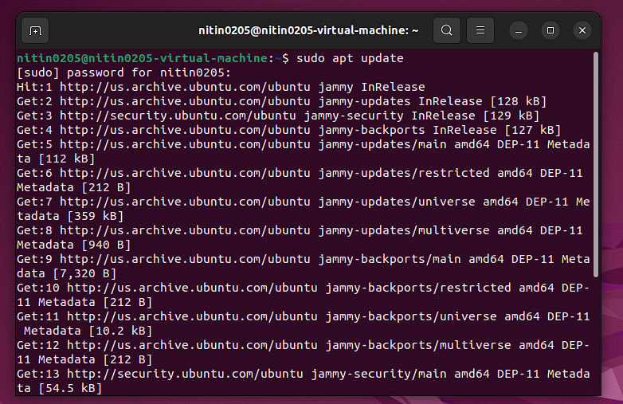
2.	Upgrade the System
    
3.	Reboot the VM
    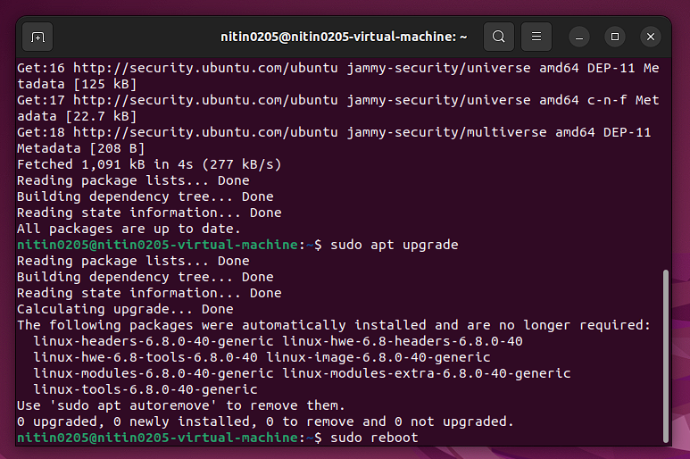

USER TASKS:
4.	Switch to the root user

    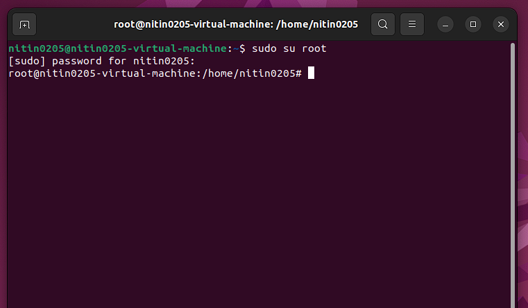
5.	Create new users(useradd vs adduser)
    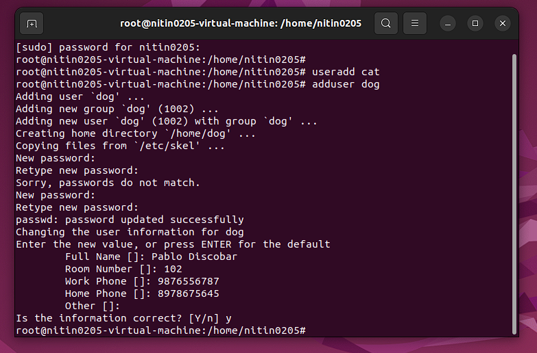
6.	Switch to the user dog
 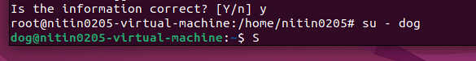

7.	Attempt to create a new user logged in as user – dog
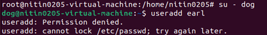
 

8.	Return to my main account and delete user – cat
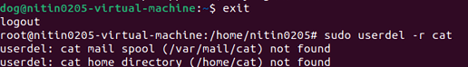
 

9.	Change the password for user – dog

 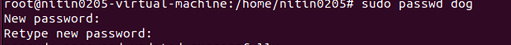

10.	Why staying logged in as root is bad practice
a.	The root user can execute destructive commands without confirmation
b.	High risk of accidental system damage
c.	Violates least-privilege security standards

11.	Command to see user id

 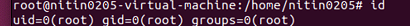

GROUP  TASKS

12.	View Groups

 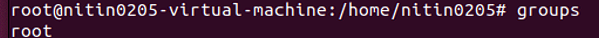

13.	Giving user – dog sudo privileges and switching into the account

 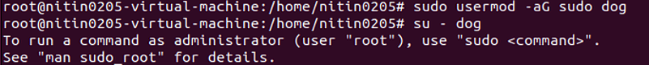

14.	Creating a new group called cybersec

 

15.	Add user – dog to the cybersec group
 

16.	Checking what groups does user – dog belong to  

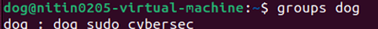

17.	Creating a new directory and checking permissions

 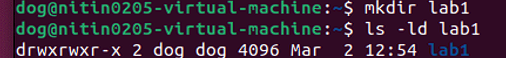

18.	Creating a bash script called helloworld

 
 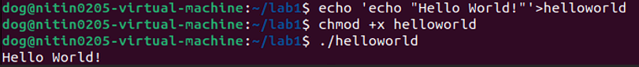

19.	Checking file permissions and changing the permissions so that even the group has write and execute permissions	
 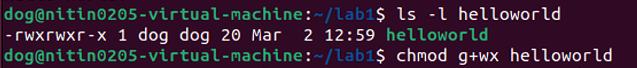

20.	Viewing Access Control Lists of the file using getfacl

 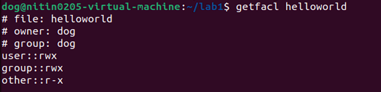

21.	Giving user – dog permission to read and write using setfacl
 

