# Environment Variable and Set-UID Program Lab Report

## Table of Contents  
1. Task 1: Manipulating Environment Variables  
2. Task 2: Passing Environment Variables from Parent to Child  
3. Task 3: Environment Variables and `execve()`  
4. Task 4: Environment Variables and `system()`  
5. Task 5: Environment Variables and Set-UID Programs  
6. Task 6: The PATH Environment Variable and Set-UID Programs  
7. Task 7: The LD_PRELOAD Environment Variable and Set-UID Programs  
8. Task 8: Capability Leaking (Command Injection and Mitigation) 
9. Task 9: Capability Leak via Inherited File Descriptor  
10. Conclusion  
11. GitHub Repository Link  

## Task 1: Manipulating Environment Variables

### Steps Performed
1. Used `printenv` to display all environment variables.
2. Printed the current working directory using:  
   `printenv PWD`
3. Set a new variable:
   `export TESTVAR="HELLO_SEED_LAB"`
4. Verified it:
   `printenv TESTVAR`
5. Unset the variable:
   `unset TESTVAR`
   `printenv TESTVAR`

### Screenshots
 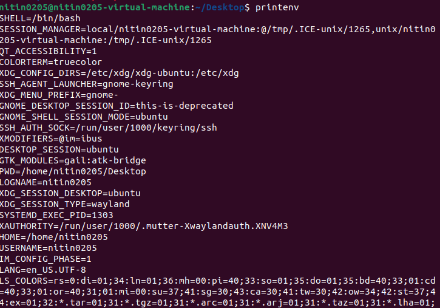
 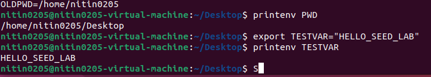
 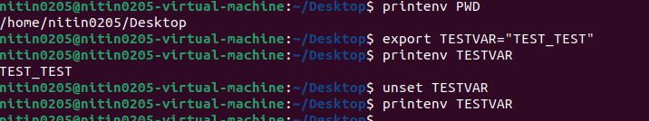


### Observations and Explanations
- New environment variables can be set and viewed using shell commands.
- Unsetting an environment variable makes it disappear from the environment.


## Task 2: Passing Environment Variables from Parent to Child

### Steps Performed
1. Compiled `myprintenv.c` to print environment variables in a child process.
2. Ran the program and redirected parent and child outputs to separate files.
3. Used `diff output1 output2` to compare.

### Screenshots
     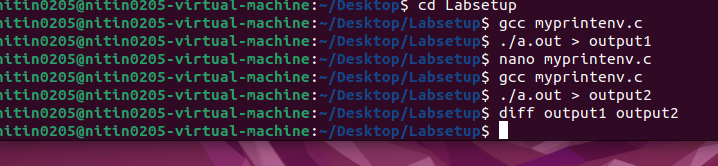
     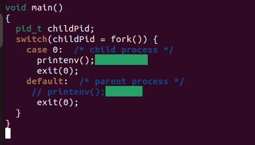

### Observations and Explanations
- Both parent and child process outputs were identical, proving children inherit all environment variables from the parent at process creation.

## Task 3: Environment Variables and `execve()`

### Steps Performed
1. Compiled `myenv.c` that calls `execve("/usr/bin/env")` with the current environment.
2. Ran it; `/usr/bin/env` printed all current environment variables.

### Screenshots
     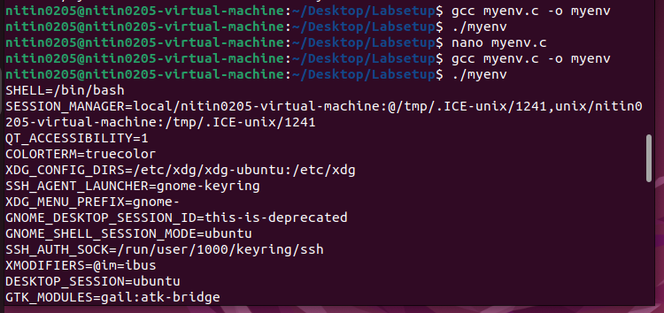

### Observations and Explanations
- All environment variables are inherited by the new program when the parent provides its environment to `execve()`.

## Task 4: Environment Variables and `system()`

### Steps Performed
1. Compiled `system_env.c`.
2. Ran the program and observed `/usr/bin/env` output.

### Screenshots
     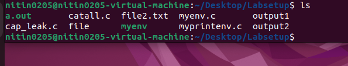
     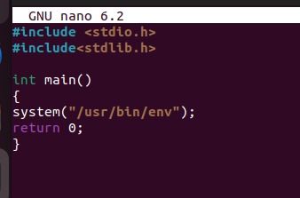
     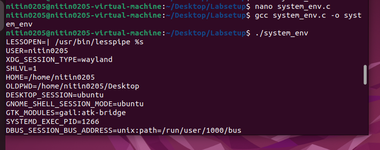

### Observations and Explanations
- Subprocesses spawned using `system()` inherit the parent's environment unless the parent specifically changes it.

## Task 5: Environment Variables and Set-UID Programs

### Steps Performed
1. Compiled `foo.c` to print all environment variables, then set owner to root and permissions to 4755 (`chmod 4755 foo`).
2. Exported custom variable:
   `export ANY_NAME="NAME"`
3. Exported potentially dangerous variables:
   `export PATH=/tmp:$PATH`
   `export LD_LIBRARY_PATH=/tmp`
4. Ran `./foo` as Set-UID root.

### Screenshots
     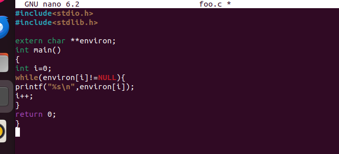
     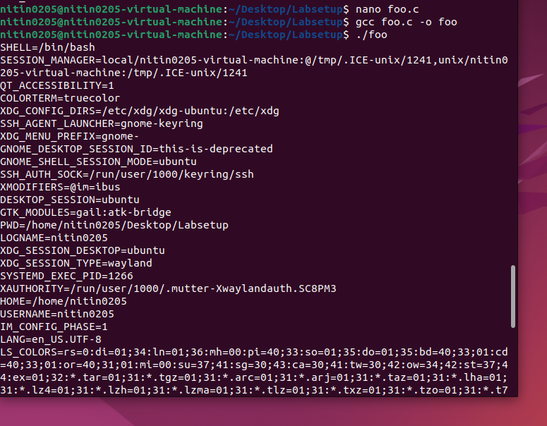
     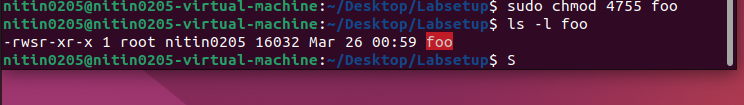
     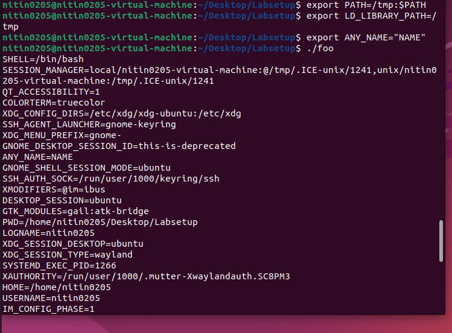

### Observations and Explanations
- Custom variables appeared in output.
- Security-sensitive variables like `LD_LIBRARY_PATH` did **not** appear — the operating system filtered these to protect Set-UID programs from attacks.

## Task 6: The PATH Environment Variable and Set-UID Programs

### Steps Performed
1. Compiled a program (`path.c`) that does `system("ls");`.
2. Set the program owner to root and permissions to 4755.
3. Created a malicious `/tmp/ls`:
   ```bash
   #!/bin/bash
   echo "HACKED!!!!!!!!!!!!!!!"
   ```
   Made it executable.
4. Exported a `PATH` putting `/tmp` first.
5. Ran the vulnerable Set-UID program.

### Screenshots
     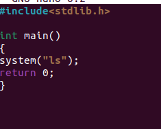
     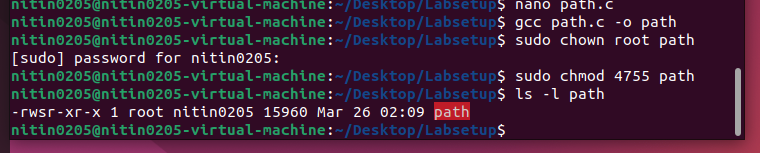
     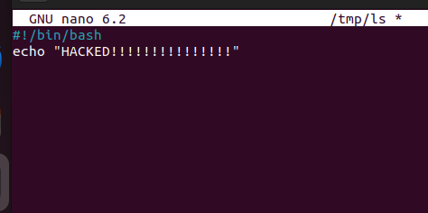
     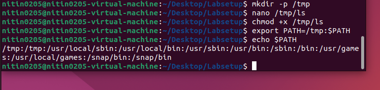
     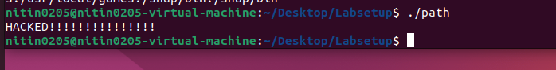
### Observations and Explanations
- The program executed `/tmp/ls` (malicious script) instead of system `ls`, running with root privileges.
- This demonstrates how Set-UID programs using relative paths or `system()` are susceptible to path hijacking.

## Task 7: The LD_PRELOAD Environment Variable and Set-UID Programs

### Steps Performed
1. Compiled a test program calling `sleep(1)` and set `LD_PRELOAD`.
2. Set `LD_PRELOAD` to the path of the custom library.
3. Confirmed override worked for regular user: saw "I am not sleeping".
4. Made program Set-UID root and reran.

### Screenshots
    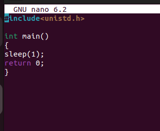
    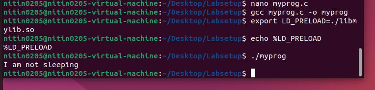
    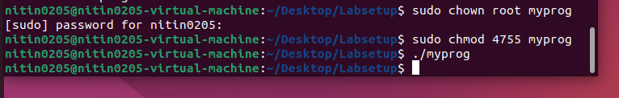
### Observations and Explanations
- `LD_PRELOAD` is ignored when executing Set-UID programs; the override does not take effect.  
- This restriction is enforced by the OS loader for security.

## Task 8: Capability Leaking (Command Injection and Mitigation)

### Part 1: Vulnerable Version Using system()
#### Steps Performed
1. Wrote a vulnerable Set-UID root program (`catall.c`).
2. Set up the binary:
    - Compiled, set Set-UID root permissions (`chown root; chmod 4755`).
    - Created protected file `/tmp/protected` owned by root.
3. Attempted exploitation:
    - Ran: `./catall "/tmp/protected; rm /tmp/protected"`
    - The output showed an attempt to remove the file, but it failed: `rm: cannot remove '/tmp/protected': Operation not permitted`

#### Observations and Explanation
- The code is vulnerable to command injection, as the injected `rm` command was executed.
- In practice, the attack failed to delete `/tmp/protected`. This was likely due to system-level protections, such as modern Linux security modules, immutable file attributes, or restrictions in the lab VM.
- **Key lesson**: Although this system blocked the deletion, the vulnerability is real and could be exploited in less restricted environments.

### Part 2: Secure Version Using execve()
### Steps Performed
1. Modified `catall.c` to use `execve()` instead of `system()`.
2. Compiled and set Set-UID root again.
3. Retried attack with the same injection string:
   `./catall "/tmp/protected; rm /tmp/protected"`
   The output was: `/bin/cat: '/tmp/protected; rm /tmp/protected': No such file or directory`
   The file `/tmp/protected` was not deleted and remained intact.

#### Observations and Explanation
- No injection possible: Since `execve()` passes arguments directly to `/bin/cat` and does not invoke a shell, the entire input is treated as a filename—including the semicolon and everything after it.
- Even with an attempted exploit string, the attack failed safely.
- **Security recommendation**: Always use `execve()` (or similar), never `system()` with user input in privileged programs.

### Screenshots
 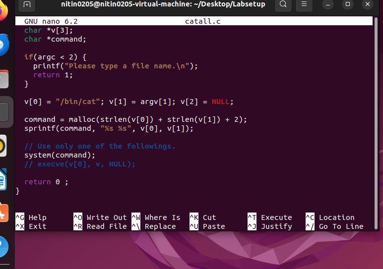
 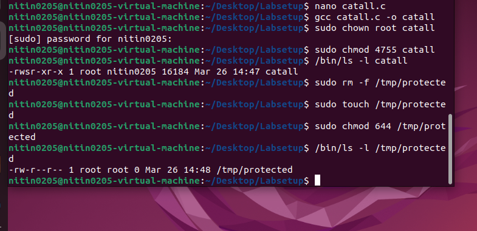
 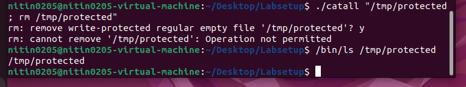
 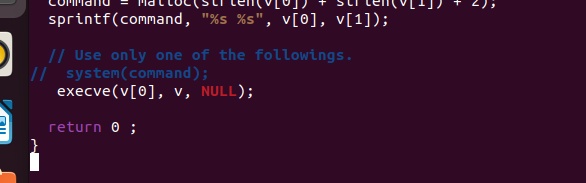
 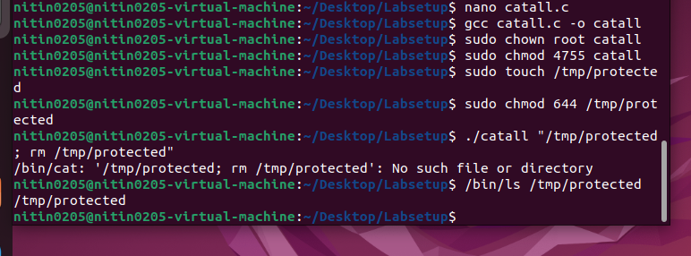
## Task 9: Capability Leak via Inherited File Descriptor

### Steps Performed
1. Create a root-owned file:
   - `sudo touch /etc/zzz`
   - `sudo chmod 644 /etc/zzz`
   - Confirmed permissions
2. Write and compile a Set-UID root program:
   - Edited `cap_leak.c` and compiled it.
   - Changed ownership and permissions to root, checked with `ls -l cap_leak`.
3. Run the Set-UID program:
   - Executed `./cap_leak`: the output was `fd is 3`, indicating the file descriptor number for `/etc/zzz` is 3 and is open in the current shell.
4. Exploit the open file descriptor:
   - In the running shell, used `echo "CAPABILITY LEAK SUCCESS" >&3`
   - This writes to `/etc/zzz` through the inherited descriptor, despite lacking normal write permissions.
   - Verified with `cat /etc/zzz`, which confirmed the file content was set to `"CAPABILITY LEAK SUCCESS"`.

### Screenshots
 
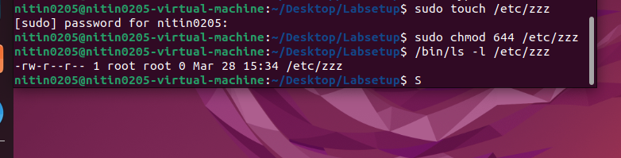
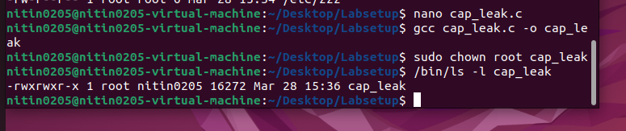
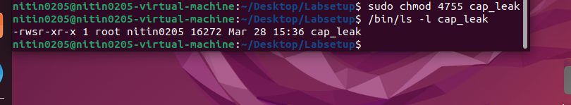
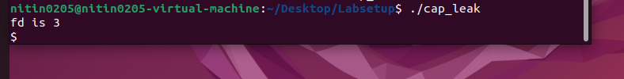
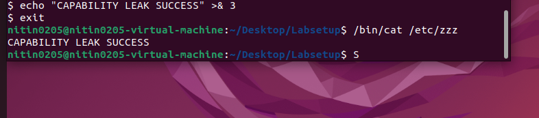

### Observations and Explanations
- The Set-UID program, running as root, opens `/etc/zzz` for writing and leaks the file descriptor to a spawned shell.
- This shell, still running with the open descriptor, allows a normal user to write to a root-protected file via `>&3`.
- This attack works **even if Set-UID privileges are dropped after opening the file**, because the file descriptor remains valid.

## Conclusion
This lab demonstrated the crucial security issues related to environment variables and Set-UID programs in Linux. I observed how environment variables are inherited, how Set-UID programs are protected from dangerous variables, and how improper use of functions like `system()` can lead to command injection vulnerabilities. I also learned that using `execve()` and properly managing file descriptors prevents these attacks. Overall, the lab reinforced the importance of secure coding practices and careful privilege management in system-level programming.